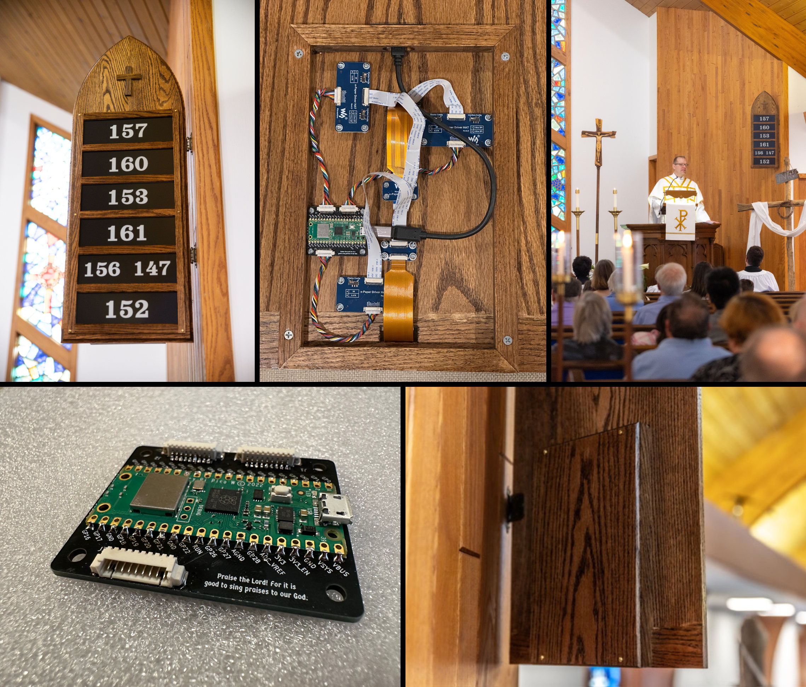

# eHymnBoard

A digital hymn board using e-ink screens. Designed and built by Michael Spencer and Christopher Spencer.

This was a really interesting opportunity to explore how we might leverage modern technology in an anti-technology, anti-screens way. Hymn boards are a beautiful contrast to the modern trend of putting big distracting glowing screens in the front of the sanctuary by directing the congregation to a hymnal, a physical book with a collection of beloved time-tested hymns, a book that belongs not just in the sanctuary but in the home for daily family devotions.

The e-ink is as minimally distracting as possible. The screens have no light and do not glow at all; the e-ink particles combined with a matte finish makes them look "real" and "physical" and not digital or screen-like.They are updated once before the service and are literally powered off for the entire duration of the service (due to its physical nature, e-ink "holds" its content without power).

Looking for other projects that explore how modern technology can enhance tradition? Check out the [St. Martin Luther Zimbelstern](https://github.com/cmspencer109/Zimbelstern) by Christopher Spencer.

### Project Parts and Tech Stack

**Device**

The on-device code is responsible for driving the e-ink screens and handling the network communication with the server.

- Raspberry Pi Pico W
- [3x Waveshare 13.3" E-Paper HAT (K)](https://www.waveshare.com/product/ai/displays/e-paper/13.3inch-e-paper-hat-k.htm)
- Pico SDK
- C++

**Server**

The web app and backend for the eHymnBoard project.

- Python 3
- Flask
- Tailwind CSS
- daisyUI

Code is deployed to a [Hetzner VPS](https://www.hetzner.com/cloud/) using [Dokku](https://dokku.com).

**PCB Designs**

Custom PCBs that add picoblade connectors to the Pi Pico for the e-ink screens to connect to.

- KiCad 6

**CAD Designs**

CAD designs for the actual wood hymn board, the routing jig, and 3D printed standoffs for mounting all the circuit boards in the enclosure.

[OnShape CAD designs](https://cad.onshape.com/documents/b7beeccbdc2f765f30134b80/w/63d45aaa309ee02d139aa6aa/e/1ed80022fc77088e67dab883)

### Suppliers

No affiliation or sponsorship, just good suppliers we found.

- [Waveshare](https://www.waveshare.com/) - E-ink screens
- [DigiKey](https://www.digikey.com/) - Electronic components
- [JLCPCB](https://jlcpcb.com/) - PCB manufacturing
- [Woodchucks Wood](https://woodchuckswood.com/) - Wood for the boards

### License

- The device code is licensed under the [GNU General Public License v3.0 or later](https://www.gnu.org/licenses/gpl-3.0.en.html).
- The server code is licensed under the [GNU Affero General Public License v3.0 or later](https://www.gnu.org/licenses/agpl-3.0.en.html).
- The CAD models and PCB designs are licensed under the [CERN Open Hardware License v2 - Strongly Reciprocal](https://gitlab.com/ohwr/project/cernohl/-/wikis/uploads/819d71bea3458f71fba6cf4fb0f2de6b/cern_ohl_s_v2.txt).
